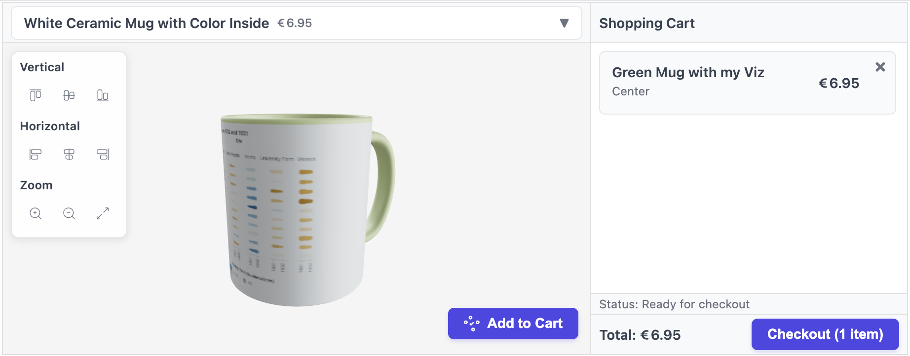

# ChartOut

> Coming Soon!

**Print Your Insights, Anytime, Anywhere**

> With every purchase, we donate 10% to NumFOCUS to support open-source scientific software.

ChartOut turns data visualizations into beautiful, printed products. You create a chart, pick a product, and chartout handles everything from 3D preview to order fulfilment.

## Getting started

- **Python / Jupyter** - full docs in [`python/`](python)

  ```python
  import altair as alt
  import chartout

  chart = alt.Chart(data).mark_point().encode(x='x', y='y')

  item = chartout.item('mug_black_11oz', chart)
  store = chartout.Store(item)
  store  # renders 3D preview + checkout in Jupyter
  ```

  

- **JavaScript / React** — full docs in [`docs/`](docs)

The interactive 3D widget is published separately as a npm package:
[`chartout` on npm](https://www.npmjs.com/package/chartout)


## Contributing

Contributions are welcome! Please feel free to submit a Pull Request.
